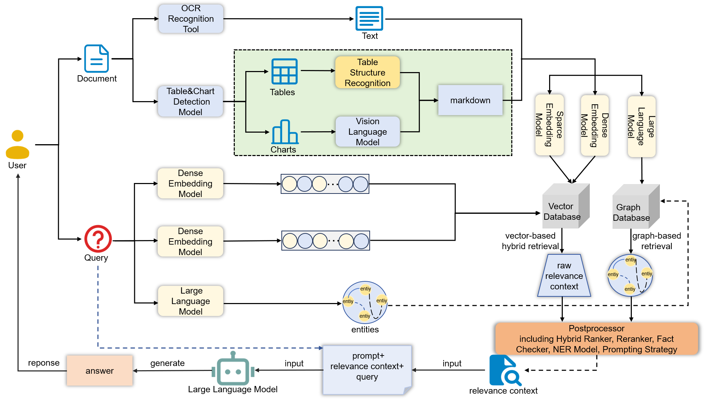

# NER_MultimodalRAG
Paper：《Multimodal RAG for Financial Documents: BART-Based Financial Named Entity Recognition and Attention-based Table Parsing for Financial QA Enhancement》

• We propose a BART-based Chinese financial named entity recognition method. This approach leverages Chinese BART to enhance contextual understanding of long texts and employs a multi-level feature fusion convolutional module to integrate shallow features with deep semantic information. A BiLSTM is then used to capture sequential dependencies and temporal information, and a CRF layer optimizes entity boundary prediction, enabling efficient recognition of key financial entities. By incorporating a prompt-guided strategy, the model can explicitly capture and model entity and relation information, thereby inferring the implicit relationships within each text block. This improves the accuracy of entity recognition and semantic understanding, while also enhancing the model’s logical reasoning and interpretability.

• We design an attention-based table parsing model tailored for financial documents, which significantly improves the accuracy of multimodal table interpretation while optimizing memory usage, thereby enhancing the efficiency of the model in large scale financial document processing scenarios.

• To address the lack of high-quality annotated data for Chinese financial multimodal RAG text chunks, we construct a novel Chinese financial multimodal NER dataset. This dataset includes multimodal Markdown data extracted from real financial documents, covering text, tables and figures, along with corresponding annotations, providing a reliable data foundation for building Chinese financial RAG text chunk NER models.
